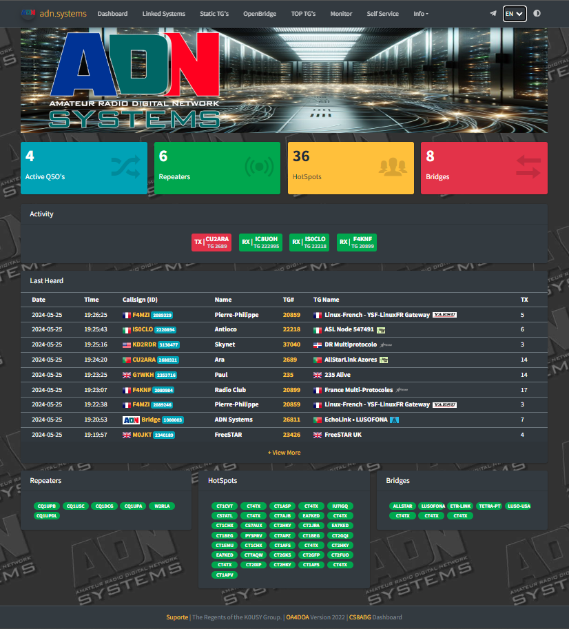

## ADN Systems Dashboard by CS8ABG



## Install Instructions

Supported versions: Debian 10, Debian 11, Ubuntu 18.04, 20.04, 22.04.

**Install/Update Script**

```bash
apt-get install -y curl
```

```bash
curl -sSL https://raw.githubusercontent.com/Amateur-Digital-Network/ADN-Dashboard/main/install.sh -o install.sh && bash install.sh
```


**Manual Install**

Install required packages
```bash
apt-get update &&
apt-get install -y git wget nano python3 python3-pip python3-dev libffi-dev libssl-dev cargo sed build-essential apache2 php libapache2-mod-php php-sqlite3 &&
pip3 install --no-cache-dir bitstring bitarray Twisted dmr_utils3 configparser resettabletimer setproctitle Pyro5 spyne setuptools wheel autobahn jinja2 MarkupSafe pyOpenSSL service-identity bitarray
```

Clone the Dashboard
```bash
cd /opt &&
git clone https://github.com/Amateur-Digital-Network/ADN-Dashboard.git dashboard 
```

Create config files
```bash
cd dashboard &&
cp dashboard_SAMPLE.cfg dashboard.cfg &&
cd proxy &&
cp proxy_SAMPLE.cfg proxy.cfg
```

Create the database file
```bash
cd /opt/dashboard &&
python3 dash_db.py
```

Set the ownership of html folder
```bash
chown -R www-data:www-data /opt/dashboard/html/
```

Create Apache configuration
```bash
nano /etc/apache2/sites-available/adndash-default.conf
```
Paste this to the file and save the file (CTRL+S CTRL+X)
```bash
<VirtualHost *:80>
	ServerAdmin webmaster@localhost
	DocumentRoot /opt/dashboard/html
	ErrorLog \${APACHE_LOG_DIR}/error.log
	CustomLog \${APACHE_LOG_DIR}/access.log combined
</VirtualHost>
```

Change apache.conf
```bash
nano /etc/apache2/apache2.conf
```
add this to the apache2.conf and save the file (CTRL+S CTRL+X)
```bash
<Directory /opt/dashboard/>
	Options Indexes FollowSymLinks
	AllowOverride None
	Require all granted
</Directory>
```

Reload apache configurations
```bash
a2dissite 000-default.conf &&
a2ensite adndash-default.conf &&
systemctl enable apache2 &&
systemctl restart apache2
```

Create Dashboard service
```bash
nano /etc/systemd/system/adn_dashboard.service
```
Paste this to the file and save the file (CTRL+S CTRL+X)
```bash
[Unit]
Description=ADN Dashboard
After=network-online.target syslog.target
Wants=network-online.target

[Service]
StandardOutput=null
WorkingDirectory=/opt/dashboard
RestartSec=3
ExecStart=/usr/bin/python3 /opt/dashboard/dashboard.py
Restart=on-abort

[Install]
WantedBy=multi-user.target
```

Create Proxy service
```bash
nano /etc/systemd/system/adn_proxy.service
```
Paste this to the file and save the file (CTRL+S CTRL+X)
```bash
[Unit]
Description=ADN Server Proxy
After=multi-user.target

[Service]
StandardOutput=null
WorkingDirectory=/opt/dashboard
RestartSec=3
ExecStart=/usr/bin/python3 /opt/dashboard/proxy/hotspot_proxy_v2.py -c /opt/dashboard/proxy/proxy.cfg
Restart=on-failure

[Install]
WantedBy=multi-user.target
```

Enable the Services and Start
```bash
systemctl enable adn_proxy.service &&
systemctl enable adn_dashboard.service &&
systemctl start adn_proxy.service &&
systemctl start adn_dashboard.service
```


## Flags:
***Flags have been introduced to add visual indicators for Talkgroups (TG) or DMR IDs. To enable flags for specific TGs or DMR IDs, follow these steps:***

- If you see the world flag flickering in the `lastheard`, `Linked systems`, etc. tables, you need to add or copy a new flag image in the `flags` folder.
- The flag image should be named with the first three digits of the Talkgroup or DMR ID.
- For example, if the Talkgroup is 12345678, place a file called `123.png` in the `flags` folder.

## Repeaters, Hotspots, and Bridges:
***The dashboard now distinguishes between Repeaters, Hotspots, and Bridges based on their DMR IDs and/or TX/RX frequency.***

- If a DMR ID has 6 digits, it is considered a Repeater and will be displayed in the `Repeaters` table.
- If a DMR ID has 7 digits or more and has a TX/RX frequency associated with it, it is recognized as a Hotspot and will be shown in the `Hotspots` table.
- If a DMR ID has 7 digits or more and has a TX/RX frequency of 0 (zero), it is identified as a Bridge and will appear in the `Bridges` table.


---
**Credits**

Python 3 implementation of N0MJS HBmonitor for HBlink https://github.com/kc1awv/hbmonitor3

HBMonitor v2 for DMR Server based on HBlink/FreeDMR https://github.com/sp2ong/HBMonv2 

FDMR Monitor for FreeDMR Servera based on HBMonv2 https://github.com/yuvelq/FDMR-Monitor

---

This program is free software; you can redistribute it and/or modify it under the terms of the GNU General Public License as published by the Free Software Foundation; either version 3 of 
the License, or (at your option) any later version.

This program is distributed in the hope that it will be useful, but WITHOUT ANY WARRANTY; without even the implied warranty of MERCHANTABILITY or FITNESS FOR A PARTICULAR PURPOSE. See the 
GNU General Public License for more details.

You should have received a copy of the GNU General Public License along with this program; if not, write to the Free Software Foundation, Inc., 51 Franklin Street, Fifth Floor, Boston, MA 
02110-1301  USA

---